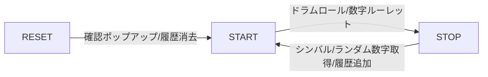

# 機能仕様

## 状態遷移図

## 機能詳細

- start を押す
  - ドラムロールが鳴る
  - 左上部の数字が一定間隔でランダム表示される
  - start/stop ボタンは `stop` となる
  - ドラムロールが鳴り終わると自動的に数字が選択され、`stop` 表示になる
- stop を押す
  - ドラムロールを停止する
  - シンバルが鳴動する
  - 左上部の数字のランダム表示を停止する
  - 止まった = 選択された数字を Hit Numbers に追加する
  - start/stop ボタンは `start` となる
- reset を押す
  - confirm を出す
  - Hit Numbers に表示されている数字を全消去する
  - 左上部の数字は 00 となる
  - confirm 中、画面の変動はない
    - 数字選択中に reset を押下した場合、ドラムロールは鳴り続けるが、数字のランダム表示は停止する
- reload 時
  - start/stop ボタンは `start` となる
  - 左上部の数字は 00 となる
  - Hit Numbers は reset されず、表示されたままとなる
