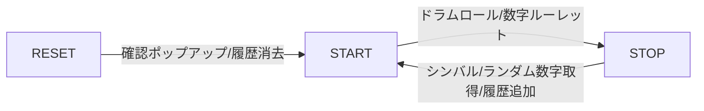

# Bingo Machine

## 本番環境

- [GitHub Pages](https://rohta.github.io/bingo/)で構築

## local開発

- 環境の立ち上げは、以下を実行
  - git clone
  - nodeとpnpmをpackage.jsonで指定されたバージョンで設定
  - `pnpm i --frozen-lockfile`
  - `pnpm run dev`
- タグの設定
  - タグ
    - `git config --local tag.template $(git rev-parse --show-toplevel)/git-tag-message.txt`を実行
    - タグ付け時は、表題の`メジャー・マイナー・パッチ`から該当しない文言を削除
    - 以降に、セマンティックバージョニングにしたがって、バージョンアップの理由を記載

## 機能図

## 機能詳細

- startを押す
  - ドラムロールが鳴る
  - 左上部の数字が一定間隔でランダム表示される
  - start/stopボタンは`stop`となる
  - ドラムロールが鳴り終わると自動的に数字が選択され、`stop`表示になる
- stopを押す
  - ドラムロールを停止する
  - シンバルが鳴動する
  - 左上部の数字のランダム表示を停止する
  - 止まった=選択された数字をHit Numbersに追加する
  - start/stopボタンは`start`となる
- resetを押す
  - confirmを出す
  - Hit Numbersに表示されている数字を全消去する
  - 左上部の数字は00となる
  - confirm中、画面の変動はない
    - 数字選択中にresetを押下した場合、ドラムロールは鳴り続けるが、数字のランダム表示は停止する
- reload時
  - start/stopボタンは`start`となる
  - 左上部の数字は00となる
  - Hit Numbersはresetされず、表示されたままとなる

## 技術

### Styling

- cssファイルは存在しない
- [Bootstrap5](https://getbootstrap.jp)に完全依存
  - レスポンシブ対応
  - Bootstrap5で賄えない部分のみ、style要素で指定
- fontは[Google Fonts](https://fonts.google.com)を使用

### TypeScript

#### 処理

- localStorageによる履歴機能を実装
- domManipulation.tsでは、DOMに依存するメソッドをclassに紐づけて管理
- numberList.tsでは、DOMに依存しないメソッドをclassに紐づけて管理
  - 固定想定の値はこちらで管理
- index.tsで可変値を設定

#### lint

- esLintとprettierがgit commit時に発火する
  - huskyとlint-stagedで設定
- esLintとprettierの設定はpackage.jsonに集約
  - 設定ファイルを作成せず、一覧性を追求
  - esLintは独自設定せず、recommendのルールに準拠
- tsconfigは、[@tsconfig/strictest](https://github.com/tsconfig/bases/blob/main/bases/strictest.json)のルールをさらに厳格にして適用

### GitHub

#### GitHub Actions

- GitHub Pagesへのdeploy
- 外形監視
- 依存モジュールの脆弱性検査
- 放置Issue/PRの自動削除
- CodeQLで脆弱性を含むコードの検出（TypeScriptのみ）

#### モジュールアップデート

- dependabot.yml
  - module updateのPull Requestが週一で最大10件作成されるように設定

#### 各種テンプレート

- Issue
- Pull Requests
- Security Policy

#### リリースノート

- GitHubの機能を利用

#### コードオーナー

- すべて@ROhta
