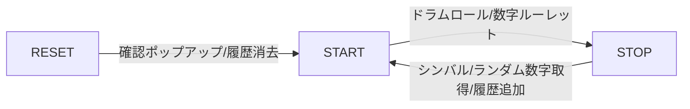

# Bingo Machine

## 本番環境

- [GitHub Pages](https://rohta.github.io/bingo/)で構築

## local 開発

- git clone
- `npm ci`
- `npm run dev`

## 機能図

## 機能詳細

- start を押す
  - ドラムロールが鳴る
  - 左上部の数字が一定間隔でランダム表示される
  - start/stop ボタンは`stop`となる
  - ドラムロールが鳴り終わると自動的に数字が選択され、`stop`表示になる
- stop を押す
  - ドラムロールを停止する
  - シンバルが鳴動する
  - 左上部の数字のランダム表示を停止する
  - 止まった=選択された数字を Hit Numbers に追加する
  - start/stop ボタンは`start`となる
- reset を押す
  - confirm を出す
  - Hit Numbers に表示されている数字を全消去する
  - 左上部の数字は 00 となる
  - confirm 中、画面の変動はない
    - 数字選択中に reset を押下した場合、ドラムロールは鳴り続けるが、数字のランダム表示は停止する
- reload 時
  - start/stop ボタンは`start`となる
  - 左上部の数字は 00 となる
  - Hit Numbers は reset されず、表示されたままとなる

## 技術

### Styling

- css ファイルは存在しない
- [Bootstrap5](https://getbootstrap.jp) に完全依存
  - レスポンシブ対応
  - Bootstrap5 で賄えない部分のみ、style 要素で指定
- font は[Google Fonts](https://fonts.google.com)を使用

### TypeScript

#### 処理

- localStorage による履歴機能を実装
- domManipulation.ts では、DOM に依存するメソッドを class に紐づけて管理
- numberList.ts では、DOM に依存しないメソッドを class に紐づけて管理
  - 固定想定の値はこちらで管理
- index.ts で可変値を設定

#### lint

- esLint と prettier が git commit 時に発火する
  - husky と lint-staged で設定
- esLint と prettier の設定は package.json に集約
  - 設定ファイルを作成せず、一覧性を追求
  - esLint は独自設定せず、recommend のルールに準拠
- tsconfig は、[@tsconfig/strictest](https://github.com/tsconfig/bases/blob/main/bases/strictest.json) のルールをさらに厳格にして適用

### GitHub

#### GitHub Actions

- GitHub Pages への deploy
- 外形監視
- CodeQL で脆弱性を含むコードの検出（TypeScript のみ）

#### 脆弱性対応

- dependabot.yml
  - module update の Pull Request が週一で最大 10 件作成されるように設定

#### 各種テンプレート

- Issue
- Pull Requests
- Security Policy

#### リリースノート

- GitHub の機能を利用

#### コードオーナー

- すべて @ROhta
