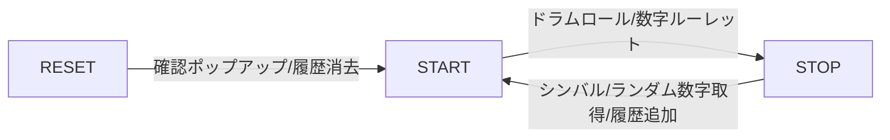

# Bingo Machine

パーティ向けビンゴ抽選機。

## 本番環境

- [GitHub Pages](https://rohta.github.io/bingo/) で公開

## ローカル環境構築

- `git clone`
- node と pnpm を `package.json` で指定されたバージョンに設定
- `pnpm i --frozen-lockfile`
- `pnpm run dev`

## 機能図

```mermaid
flowchart LR
RESET-->|確認ポップアップ/履歴消去|START-->|ドラムロール/数字ルーレット|STOP-->|シンバル/ランダム数字取得/履歴追加|START
```

## ドキュメント

開発フロー・機能詳細・技術スタック・運用ルール・PR レビュー方針などは AI エージェント向け指示と共通化しており、以下に集約されています。

- [`.apm/instructions/project-overview.instructions.md`](./.apm/instructions/project-overview.instructions.md) — プロジェクト概要・開発フロー・技術スタック・運用ルール
- [`.apm/instructions/pr-review.instructions.md`](./.apm/instructions/pr-review.instructions.md) — PR レビュー時のルール

これらは [microsoft/apm](https://github.com/microsoft/apm) によって管理され、`apm compile` で Claude Code / Codex / GitHub Copilot 向けファイル (`CLAUDE.md` / `AGENTS.md` / `.claude/rules/` / `.github/instructions/`) に展開されます。
